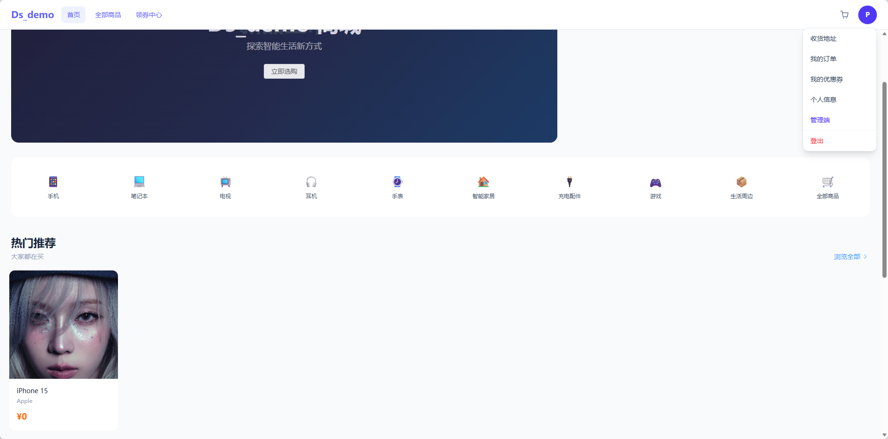
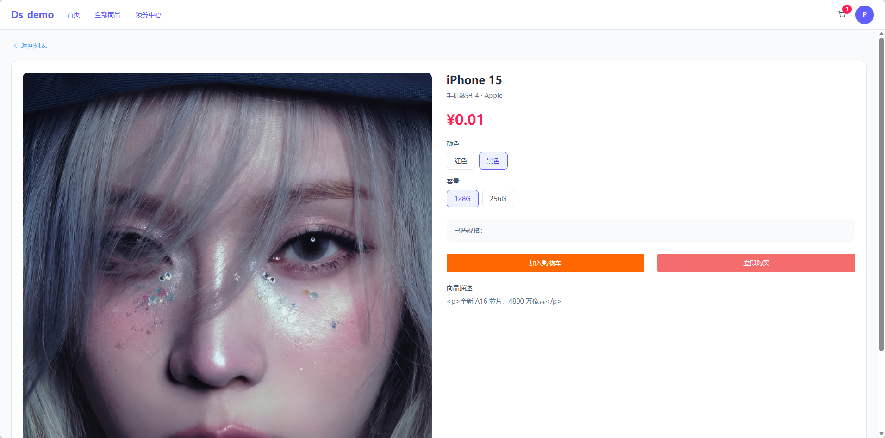
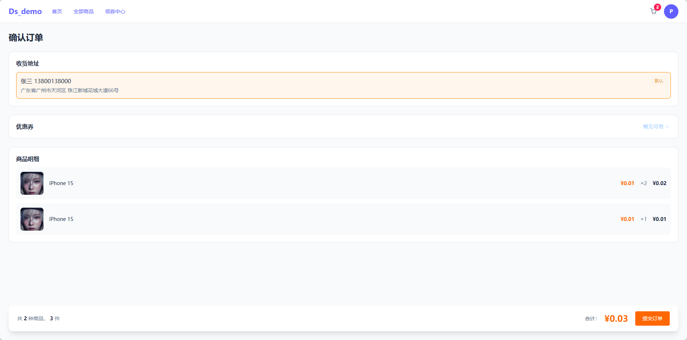
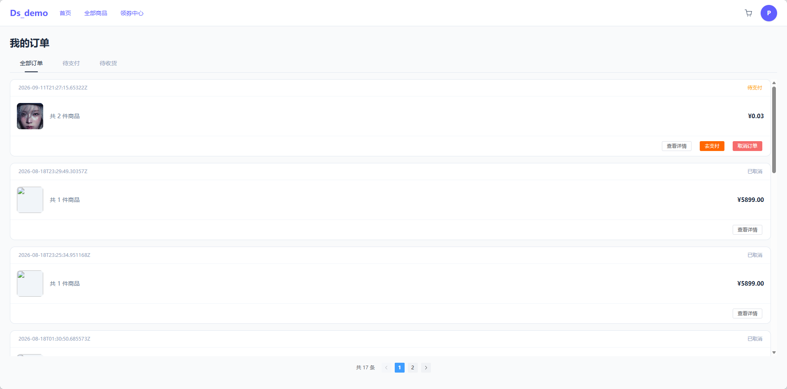
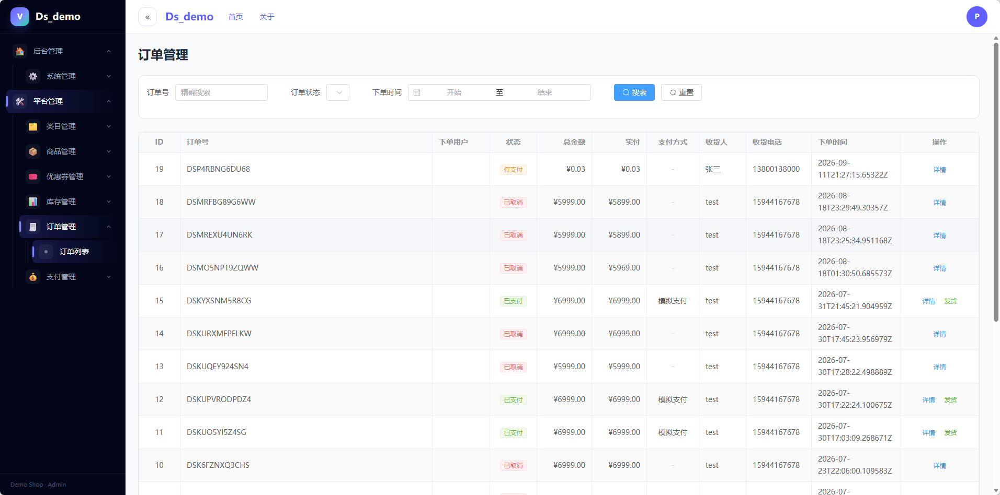
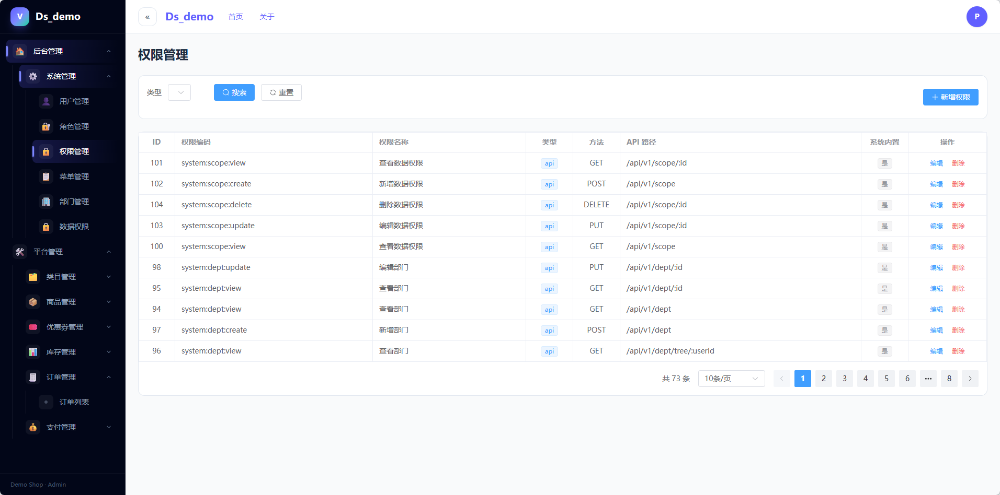

<div align="center">

# 🛍️ demo-shop

**前后端分离电商系统 —— Go (Gin) + Vue 3 全栈实践项目**


[](https://github.com/ls0314/go-shop/actions/workflows/ci.yml)

覆盖「用户端购买 + 管理端运营」完整业务链路：RBAC 权限体系、高并发安全控制、订单状态机、消息队列、全文检索、支付抽象在真实业务场景中的工程化落地。每个核心设计均可在代码中定位实现。

</div>

---

## 目录

- [界面速览](#界面速览)
- [核心技术亮点](#核心技术亮点)
- [核心链路设计](#核心链路设计)
- [功能特性](#功能特性)
- [技术栈](#技术栈)
- [系统架构](#系统架构)
- [项目结构](#项目结构)
- [快速开始](#快速开始)

---

##  界面速览

| 用户端 · 首页 | 用户端 · 商品详情 | 用户端 · 购物车/结算 |
|:---:|:---:|:---:|
|  |  |  |
| **用户端 · 订单详情** | **管理端 · 订单管理** | **管理端 · RBAC 权限** |
|  |  |  |

---

##  核心技术亮点

### 1. 优惠券领取并发控制 —— 悲观锁 + 乐观锁「双防线」

高并发领券要同时解决两个问题：**单人超领**（绕过限领次数）与**总量超发**（库存卖超）。两条防线分别拦截：

```sql
-- 第一道防线：悲观锁，同模板的并发领取在此串行化
SELECT * FROM coupon_template WHERE template_id = ? FOR UPDATE;
-- 锁内完成「每人限领」校验 + 插入用户券，保证「读-判断-插入」原子性

-- 第二道防线：乐观锁条件更新，数据库侧原子自增
UPDATE coupon_template SET received_count = received_count + 1
WHERE template_id = ? AND received_count < total_count;
-- 影响行数为 0 → 券已售罄 → 事务回滚，防止总量超发
```

- 整个领取过程包在单个事务中，**锁的生命周期 = 事务生命周期**，避免锁提前释放留下并发窗口
- 核销 / 归还均走条件 UPDATE（`WHERE status = 'unused'` / `WHERE status = 'used'`），并发下同一张券只有一个事务能成功，**天然幂等防 MQ 重复消费**
- 完整覆盖优惠券「领取 → 核销 → 归还」状态机

 实现：[coupon_service.go](demo-shop-back/src/service/coupon_service.go) · [coupon_repo.go](demo-shop-back/src/repository/coupon_repo.go)

### 2. 库存一致性 —— 两段式模型 + 流水台账 + 操作幂等

- **三字段库存模型**：`stock`（可售）/ `lock_stock`（锁定）/ `sold_count`（销量）分离 —— 下单只锁定、支付才真扣、取消即释放、退款再回补
- 每次变更都是 `SELECT ... FOR UPDATE` 锁 SKU 行 → 校验可用量 → 条件 UPDATE 挪锁存量，配合 `CHECK (stock >= 0 AND lock_stock >= 0)` 数据库兜底防负数
- **库存流水台账**（`sys_product_stock_log`）：每次变更写一条流水，CHECK 约束枚举变更类型；写前检查「订单 + 变更类型」是否已存在，**同一订单同一操作只执行一次**，防 MQ 重复消费 / 回调重放导致库存重复变动

 实现：[inventory_service.go](demo-shop-back/src/service/inventory_service.go)

### 3. 订单超时自动取消 —— RabbitMQ TTL + 死信队列模拟延迟消息

RabbitMQ 无原生延迟消息，采用 **TTL + DLX（死信交换机）** 方案：

```
下单事务内写 outbox 行(与订单同事务提交)      ← 见亮点 4：不在此刻直接发 MQ
      │ 投递器轮询取 pending 行
      │ 发布持久化消息(DeliveryMode: Persistent)
      ▼
order.delay.queue (无消费者, x-message-ttl = 15min)
      │ TTL 到期, 死信路由
      ▼
order.dead.exchange ──▶ order.dead.queue ──▶ 消费者 goroutine
                                                │
                                          CancelOrderBySystem:
                                          仅 pending_pay 可取消(状态机幂等)
                                          已支付/已取消 → 跳过并计 skipped
                                                │
                                    解除订单取消 + 释放库存 + 归还优惠券
```

- **延迟时长单一事实源**：队列 TTL 与下单响应的 `pay_expire_at` 都引用 `model.OrderPayTTL`，避免"用户看到的倒计时"与"系统真正取消的时刻"漂移
- 消费侧：**订单状态机前置校验天然幂等**，重复投递不会重复取消；解析失败 Ack 丢弃防无限重投递
- **系统取消不带 userId**：`CancelOrderBySystem(orderId, operator)` 跳过归属校验（该订单不属于任何用户），归属校验只保留在用户主动取消路径——早期消费者写死 `userId=4` 导致除 4 号用户外全部取消失败，已被回归用例钉死
- 解耦设计：MQ 包不依赖业务层，通过 `OrderCanceller` 接口由调用方注入，接口倒置

 实现：[rabbitmq.go](demo-shop-back/src/infra/mq/rabbitmq.go) · [consumer.go](demo-shop-back/src/infra/mq/consumer.go) · [order_timeout_scan.go](demo-shop-back/src/task/order_timeout_scan.go)

### 4. 可靠消息双保险 —— outbox 意图账本 + 超时扫描兜底

MQ 只保证"进了 Broker 且已落盘就不丢"，**不保证"发送意图"本身不丢**：订单事务提交后如果进程崩溃，"该发一条延迟消息"这个意图只存在于内存里。解法是把它换成数据库里的一行。

- **outbox 本地消息表**（`sys_outbox_message`）：下单事务内写消息行（`message_id` 唯一索引做幂等键），投递器独立轮询投递——消息不再依赖发送那一刻的网络与进程存活
- **投递器**：`1s` 轮询、单轮 `LIMIT 100`、失败按 `min(2^n 秒, 5min)` 指数退避；Redsync 锁排除多实例在同一轮内并发投递
- **语义诚实声明为 at-least-once**：`MarkSent` 在 Publish **之后**执行，因此"Publish 成功但 MarkSent 失败"必然重发。能承诺的是**下游仅一次生效**（消费侧按 `message_id` 去重 + 唯一索引兜底），不是"零重复投递"
- **超时扫描任务**（`task/order_timeout_scan.go`）：MQ 消费者对取消失败是 **Ack 丢弃、有意不重试**，所以一次 DB 瞬时超时就会让订单永久停在 `pending_pay`、库存永久锁定。扫描任务不依赖 MQ，按 `created_at + OrderPayTTL` 周期收敛——**它是这条链路唯一的安全网，不是可有可无的备份**
- **结果分流**：`cancelled` / `skipped`（已被 MQ 处理或用户已支付，正常）/ `failed`（真故障，值得告警）三态分开计数，避免"正常跳过"淹没告警
- **幂等闸与 A1 同构**：取消时先用条件 UPDATE 抢占订单状态（`RowsAffected=0` 即已被并发取消，直接返回），再退券、释放库存；不用事务外"先查后做"

 实现：[outbox_dispatcher.go](demo-shop-back/src/infra/mq/outbox_dispatcher.go) · [outbox_repo.go](demo-shop-back/src/repository/outbox_repo.go) · [order_timeout_scan.go](demo-shop-back/src/task/order_timeout_scan.go) · [000015 迁移](demo-shop-back/db/migrations/000015_create_outbox_table.up.sql)

### 5. 幂等下单 + 雪花算法分布式 ID

- 下单接口携带 `idempotent_key`，`user_order_master` 上建**唯一索引**，前端重复提交直接返回已有订单，杜绝脏单
- 自研**雪花算法**：标准 64 位划分（41 时间戳 / 10 workerId / 12 序列号），处理**同毫秒序列溢出自旋**与**时钟回拨回退**；订单号 = `"DS" + 雪花 ID 转 36 进制`
- 最大事务将「核销优惠券 → 写订单主表 → 写明细 → 逐项锁库存 → 删购物车 → 写订单日志」六类操作原子完成，repo 层通过 `WithTx(tx)` 绑定事务实例

 实现：[order_service.go](demo-shop-back/src/service/order_service.go) · [snowflake.go](demo-shop-back/src/utils/snowflake.go)

### 6. Redis 缓存体系 —— 一致性策略 + 版本号失效 + 弱依赖降级

| 缓存键 | TTL | 说明 |
|---|---|---|
| `product:detail:{user/admin}:{id}` | 10 min | 商品详情（用户端/管理端视图分离） |
| `sku:stock:{id}` | 30 s | SKU 实时库存，短 TTL 兜底 |
| `category:{id}` | 1 h | 类目树 |
| `user:perm:{id}` | 30 min | 用户权限码，省去每次请求 3 表 JOIN |
| `api:perm:v{version}:{method}:{path}` | 30 min | 接口权限点 |

- **一致性策略**：Cache-Aside 读模式（miss 回源回写）+ **写库后删除** + 短 TTL 兜底，失效失败最多 30 秒旧值
- **版本号批量失效**：接口权限缓存键带版本号，权限变更时 `INCR api:perm:version` 一次失效全部接口缓存，避免逐 key 删除
- **弱依赖降级**：Redis 不可用时打 WARN 后业务直查 DB，缓存层全部判空处理，**不阻塞主流程**

 实现：[cache.go](demo-shop-back/src/infra/cache/cache.go) · [product_service.go](demo-shop-back/src/service/product_service.go) · [permission_service.go](demo-shop-back/src/service/permission_service.go)

### 7. Elasticsearch 商品搜索 —— 增量 + 全量双周期对账

- 业务写路径同步写 ES，失败仅 WARN 降级不阻塞主流程，**靠对账任务保证最终一致**
- **增量对账（5 分钟）**：基于 Redis 时间水位（RFC3339）拉取变更商品重新索引，**水位在写入成功后才推进**（否则漏数据）
- **全量对账（12 小时）**：全量比对 DB 与 ES 的 SPU ID 差集，重建缺失文档、清理孤儿文档

 实现：[es.go](demo-shop-back/src/infra/es/es.go) · [reconcile.go](demo-shop-back/src/task/reconcile.go)

### 8. 支付网关抽象 —— 策略模式 + 回调多重校验

- 定义 `PayGateway` 接口（创建支付 / 解析回调 / 主动查询）+ 注册中心，业务层只依赖接口；当前 Mock 实现已跑通支付闭环，接入微信/支付宝零业务改动
- 支付回调安全链：**签名验证（真实网关）→ 幂等检查（已 success 直接返回）→ 金额双重校验（回调金额 = 支付单金额 = 订单应付）→ 状态机校验（仅待支付可支付）→ 单事务落库**（更新支付单 → 更新订单 → 写日志 → 逐项扣减库存）

 实现：[gateway.go](demo-shop-back/src/infra/pay/gateway.go) · [mock_gateway.go](demo-shop-back/src/infra/pay/mock_gateway.go) · [payment_service.go](demo-shop-back/src/service/payment_service.go)

### 9. RBAC 权限体系 —— 六维数据模型 + 三级权限控制

- **数据模型**：用户-角色、角色-权限、角色-菜单、菜单-权限、用户-部门、数据权限（scope）六类关联
- **接口级鉴权**：自定义 `PermissionMiddleware`，按「路由 + HTTP Method」匹配权限点，用户权限码构建 map 后 O(1) 匹配，全部管理接口统一收口
- **菜单驱动动态路由**：后端返回菜单树，前端动态生成路由与侧边栏；页面按权限码控制按钮显隐，前后端双重校验
- **两级缓存**：用户权限码与接口权限点分别缓存，权限变更走版本号批量失效（见亮点 6）

 实现：[auth.go](demo-shop-back/src/middleware/auth.go) · [permission_service.go](demo-shop-back/src/service/permission_service.go)

### 10. 工程化与代码质量

- **版本化数据库迁移**：golang-migrate 管理 14 个版本（up/down 可回滚），表结构、约束、索引全部落在 SQL；**种子与迁移分离**——演示数据走版本账本（`sys_seed_history`），事务化记账、可重入、崩溃自动续跑
- **PostgreSQL 特性利用**：部分唯一索引（`WHERE is_deleted = FALSE`，软删除不占唯一约束）、CHECK 约束防脏数据、幂等键唯一索引
- **操作日志异步审计**：请求 Body 读后回填复用；密码/token 等敏感字段**递归脱敏**；按 rune 截断防切坏中文；经有界 channel（容量 1024）由 2 个 goroutine 异步入库，队列满丢弃告警不阻塞请求
- **文件分片上传**：1MB 分片 + MD5 标识 + 断点续传（分片存在性检查），`sync.Map` 按文件粒度互斥防并发合并
- 分层架构 routes → middleware → handler → service → repository，22 个业务模块同构；全局统一响应 / 错误码；JWT 双令牌（access 30min / refresh 24h）；后台定时任务（ES 对账）
- **容器化与 CI**：前后端多阶段构建镜像（后端 ~1GB 工具链产物 → ~30MB 运行镜像）；`docker compose up -d --build` 一键起全栈（中间件 healthcheck 门禁 → 自动建库/迁移/种子 → nginx 前端）；GitHub Actions 门禁（vet / build / `go test -race`）

 实现：[operation_log.go](demo-shop-back/src/middleware/operation_log.go) · [file_upload.go](demo-shop-back/src/utils/file_upload.go) · [db/migrations](demo-shop-back/db/migrations) · [seed.go](demo-shop-back/db/seed.go)

### 11. 并发正确性验证 —— 真实 PG 并发测试 + race 检测 + CI 门禁

- **25 个并发/幂等/一致性用例**（[tests/](demo-shop-back/tests)）：300 并发抢 100 张券**恰好发出 100 张**（发放计数 / 账本行数 / 响应数三方复核）、同用户限领、库存防超卖、按「订单 + SKU + 操作类型」流水幂等、多 SKU 同订单回归、超时取消幂等与并发抢占、闸门两阶段收敛
- 断言精确到数字并**回查数据库账本**，不只看返回值；发令枪（barrier）保证竞争窗口重叠；测试基建自带独立测试库引导与数据工厂
- `go test -race` 全绿，由 GitHub Actions 在 Linux 上强制执行
- 测试驱动出真实缺陷：幂等键未含 SKU 导致多 SKU 订单绕过库存校验——已修复，并有回归用例钉死

 实现：[tests/](demo-shop-back/tests) · [CI](.github/workflows/ci.yml)

### 12. 热点路径 Redis 预扣闸门 —— Lua 原子预扣 + 对账收敛（压测 10×）

在领券/扣库存入口增加 Redis Lua 预扣闸门：**闸门挡量，DB 账本保真**。

- **O(1) 拒绝无效流量**：Lua 脚本原子完成「查余量-校验-扣减」，售罄/超限请求不触碰数据库；DB 悲观锁+条件 UPDATE 双防线原样保留为正确性锚点
- **失败补偿**：DB 事务失败时 Lua 补偿脚本归还闸门额度，`gatePassed` 标记区分「扣了没还」与「没扣就还」
- **对账收敛**：定时任务以 DB 为准单向修正闸门计数（SETNX 回填 + 偏差强制对齐），闸门允许瞬时偏差、最终一致
- **一键熔断**：`DEMO_SHOP_GATE_ENABLED` 运行时开关，Redis 故障时自动降级直走 DB，不重启实例

**压测对比**（200 并发，售罄拒绝场景，3 轮中位）：

| 指标 | 纯 DB 双防线 | Redis 闸门态 | 提升 |
|---|---|---|---|
| QPS | 707 | **7135** | **10.1×** |
| p50 / p99 | 237ms / 927ms | **22.9ms / 93.9ms** | 10.3× / 9.9× |

> 放行路径刻意设计为持平（发放 2000 张：23.2s → 24.9s）——闸门的价值是挡量而非加速放行，放行仍受 DB 事务约束保证正确性。压测后 SQL 三方复核（发放计数=账本行数=成功响应数）0 超发 0 漏发。

📄 实现：[deduct.go](demo-shop-back/src/infra/cache/deduct.go) · [stock_reconcile.go](demo-shop-back/src/task/stock_reconcile.go) · [loadgen 压测工具](demo-shop-back/cmd/loadgen/main.go)

### 13. 限流与定时任务分布式锁 —— 令牌桶 + Redsync

- **两级令牌桶限流**（`x/time/rate`）：全局兜底（200 r/s，保护 DB/下游总容量）+ 登录/注册/领券按 IP 收紧（5 r/s，防爆破），429 携带 `Retry-After`；`sync.Map` 惰性建桶 + 周期清理空闲桶防内存泄漏；`healthz` 探活豁免
- **定时任务 Redsync 分布式锁**：ES 对账与闸门对账任务跨实例互斥（`WithTries(1)` 抢不到即跳过、Expiry 到期自释放防死锁），Redis 不可用降级进程内互斥不停摆；解锁了 `cache.SetNX` 原语"有封装无调用"的历史
- 多实例语义诚实声明：进程内限流在多实例下为每实例各限一份，跨实例全局限流是 Redis Lua 的演进方向

📄 实现：[rate_limit.go](demo-shop-back/src/middleware/rate_limit.go) · [distributed_lock.go](demo-shop-back/src/task/distributed_lock.go)

### 14. Prometheus 可观测体系 —— 三层指标 + 抓取编排

- **HTTP 层**（流量/延迟/错误）：`http_server_requests_total`、延迟直方图——route 标签强制使用路由模板（`FullPath`），未匹配请求归入 `UNMATCHED`，杜绝指标基数爆炸
- **业务层**：领券成败计数（`coupon_receive_total`，gate/db 双路径耗时对比）、库存超卖拒绝率、超时取消三态（`cancelled`/`skipped`/`failed`）、outbox 投递结果与积压水位、限流命中数
- **基础设施层**（饱和度）：DB 连接池水位采样（`db_pool_in_use/open/wait_count`，持续增长的等待数即 DS-A-19 分析的雪崩前兆）
- 指标经**独立内部端口 :9002** 暴露（不映射宿主机、不被限流误伤），compose 编排 Prometheus（9090）+ Grafana（3000）自动抓取
- **双实例分实例可观测**：Prometheus 同时抓 `backend-1:9002` 与 `backend-2:9002`，自动带 `instance` 标签，Grafana 可按实例切片对比

📄 实现：[metrics.go](demo-shop-back/src/infra/metrics/metrics.go) · [metrics 中间件](demo-shop-back/src/middleware/metrics.go) · [prometheus.yml](docker/prometheus.yml)

### 15. 多实例部署与分布式正确性验证

单实例下"看起来对"的机制（唯一索引、行锁、分布式锁、workerId）只有在**多个进程同时跑**时才被真正检验，因此 compose 默认就是双实例：

- **双实例编排**：`backend-1` / `backend-2` 仅两处不同——`DEMO_SHOP_SNOWFLAKE_WORKER_ID`（1 / 2）与种子开关（只让一个实例加载种子，避免并发抢同一批种子）；其余用 YAML 锚点共享，杜绝配置漂移
- **nginx 轮询上游**（`upstream backend_cluster` + keepalive + `max_fails` 摘除），前端零感知
- **实测证据**（经 LB 并发下单，仅凭响应体即可判定）：

  | 验证项 | 结果 |
  |---|---|
  | LB 分发 | 20 次请求两实例各 22 次（含健康检查），完美轮询 |
  | **两实例都在接单** | 从订单号反推雪花位段：`workerId=1` → 4 单、`workerId=2` → 5 单 |
  | 雪花 ID 不碰撞 | 9 单 9 个不同订单号 |
  | 库存守恒 | 各 SKU `stock` 与 `order_lock` 流水逐条对得上，流水数 = 订单数 |
  | **跨实例并发取消** | 对同一订单并发打 10 次取消 → **恰好 1 次生效**，其余返回"订单已被处理"；库存只回补一次、取消日志仅 1 条 |

- **workerId 反推法**（面试可讲）：订单号 = `"DS" + base36(雪花ID)`，雪花结构为 `[41位时间][10位worker][12位序列]`，故 `workerId = (parseBase36(orderNo[2:]) >> 12) & 0x3FF`——**不需要任何内部信息就能证明订单由哪个实例生成**
- **race 检测抓到真实缺陷**：`-race` 在 CI 上抓出"`NewOrderService()` 构造期副作用写无同步包级变量"的数据竞争（多个 goroutine 并发构造时触发），修复为显式传参注入

📄 实现：[docker-compose.yml](docker-compose.yml) · [nginx.conf.template](demo_shop_front/nginx.conf.template) · [CI](.github/workflows/ci.yml)

---

##  核心链路设计

**领券并发控制**（详见[亮点 1](#1-优惠券领取并发控制--悲观锁--乐观锁双防线)）：

```
领取请求 ──▶ BEGIN TRANSACTION
              │
              ├─① SELECT ... FOR UPDATE 锁模板行   ← 悲观锁: 同模板并发在此串行化
              │     锁内校验「每人限领」→ 插入用户券
              │
              ├─② UPDATE ... SET received_count = received_count + 1
              │     WHERE received_count < total_count
              │     └─ RowsAffected == 0 → 售罄 → ROLLBACK   ← 乐观锁: 防总量超发
              ▼
            COMMIT (锁的生命周期 = 事务生命周期)
```

**下单 → 超时取消 → 资源释放**：

```
幂等检查(idempotent_key) ──▶ 事务: 核销券/锁库存/写订单 ──▶ COMMIT ──▶ 发送 15min 延迟消息
                                                                            │ TTL 到期死信
                                                                            ▼
                                            消费 ──▶ 状态机校验(仅 pending_pay) ──▶ 取消订单
                                                                                      ├─ 释放库存(条件更新+流水, 幂等)
                                                                                      └─ 归还优惠券(条件更新, 幂等)
```

**支付回调**：

```
回调 ──▶ 签名验证 ──▶ 幂等检查(已 success 直接返回) ──▶ 金额双重校验 ──▶ 状态机校验
      ──▶ 单事务: 更新支付单 → 更新订单 → 写日志 → 逐项扣减库存(行锁+流水)
```

---

## 功能特性

###  用户端

| 模块 | 说明 |
|------|------|
| 商品 | SPU/SKU 多规格、类目树浏览、ES 全文搜索、商品上下架 |
| 购物车 | 多规格勾选、实时库存校验、结算预览 |
| 订单 | 幂等下单、完整状态机(待支付→已支付→已发货→已完成/已取消)、MQ 超时自动取消 |
| 支付 | 支付网关 Mock，下单后限时支付闭环 |
| 优惠券 | 领券中心、我的卡券、结算选券核销、取消订单自动归还 |
| 用户 | 登录注册、JWT 鉴权 + 刷新令牌、收货地址管理 |

###  管理端

| 模块 | 说明 |
|------|------|
| RBAC 管理 | 用户 / 角色 / 权限 / 菜单 / 部门 / 数据权限 六个管理页面 |
| 商品运营 | 类目树、SPU/SKU 管理、库存台账与流水日志 |
| 订单管理 | 全状态流转、发货、退款处理(库存/优惠券自动归还) |
| 优惠券运营 | 模板创建(满减/直减、有效期双模式)、发放统计 |
| 操作日志 | 关键管理操作全审计(敏感字段脱敏) |

---

## 技术栈

| 端 | 技术 |
|----|------|
| 后端 | [Go 1.25](https://go.dev) · [Gin](https://github.com/gin-gonic/gin) · [GORM](https://gorm.io) · [golang-migrate](https://github.com/golang-migrate/migrate) |
| 数据层 | PostgreSQL 14（27 张业务表）· Redis 6 · Elasticsearch 7.17 · RabbitMQ 3.13 |
| 中间件 | JWT 鉴权 · Redis 缓存 · MQ 延迟消息 · ES 全文检索 |
| 前端 | [Vue 3](https://vuejs.org) `<script setup>` · [TypeScript](https://www.typescriptlang.org) · [Vite](https://vitejs.dev) · [Element Plus](https://element-plus.org) · [Pinia](https://pinia.vuejs.org) · Tailwind CSS |
| 基础设施 | Docker 多阶段构建 · docker compose 一键全栈 · GitHub Actions CI |

---

## 系统架构

```
┌─────────────────────────────┐               ┌─────────────────────────────┐
│       用户端 (Vue3)          │               │       管理端 (Vue3)         │
│   商品 / 购物车 / 下单/支付   │               │  商品/订单运营 + RBAC 管理   │
│   优惠券 / 地址 / 个人中心     │              │  菜单驱动动态路由 + 按钮权限  │
└──────────────┬──────────────┘                └──────────────┬──────────────┘
               │            JWT · RESTful · 统一响应 / 错误码  │
               └───────────────────────┬──────────────────────┘
                                       ▼
┌────────────────────────────────────────────────────────────────┐
│                后端 (Go + Gin · 严格分层)                       │
│   routes → middleware → handler → service → repository → model │
├────────────────────────────────────────────────────────────────┤
│  Redis(缓存) │ RabbitMQ(订单超时/异步) │ ES(商品搜索)            │
│  PostgreSQL(业务库 · 27 张表 · 14 个版本化迁移)                  │
└────────────────────────────────────────────────────────────────┘
```

**请求链路**：

```
请求 → routes(路由注册 / 鉴权挂载)
     → middleware：Auth(登录校验) → Permission(接口权限点) → OperationLog(审计)
     → handler：参数绑定 / 从上下文取用户 / 统一响应
     → service：业务规则 / 事务编排 / 状态机流转 / 并发控制
     → repository：GORM 数据访问 / 行锁 / 条件更新(乐观锁)
```

---

## 项目结构

```
demo-shop/
├── demo-shop-back/                 # Go 后端
│   ├── main.go                     # 入口：自动迁移 → 种子账本 → 初始化基建 → 注册路由
│   ├── db/migrations/              # 14 个 golang-migrate 版本化迁移(up/down)
│   ├── db/seeds/                   # 演示种子(版本账本 sys_seed_history 管理)
│   ├── tests/                      # 并发/幂等集成测试(真实 PG + 数据工厂)
│   ├── cmd/loadgen/                # 自研压测工具(QPS / 延迟分位数)
│   ├── Dockerfile                  # 多阶段构建(builder → alpine 运行)
│   ├── resource/application.yaml   # 配置默认值(容器内由 DEMO_SHOP_* 环境变量覆盖)
│   └── src/
│       ├── routes/                 # 22 个模块路由注册(统一挂载鉴权)
│       ├── middleware/             # Auth / Permission / OperationLog / RateLimit / Metrics
│       ├── handler/                # 22 个 HTTP 处理器
│       ├── service/                # 22 个业务服务(事务 / 状态机 / 锁)
│       ├── repository/             # 数据访问层(行锁 / 条件更新 / JOIN)
│       ├── model/                  # 实体 / 请求 / 响应 + 统一错误码
│       ├── infra/                  # 基建封装：cache(含预扣闸门) / es / mq / pay / metrics
│       ├── task/                   # 后台定时任务(ES 对账 / 闸门对账,Redsync 分布式锁)
│       └── utils/                  # JWT / 雪花 ID / 响应包装 / 分片上传
├── docker/prometheus.yml           # 指标抓取配置(backend:9002)
├── demo_shop_front/                # Vue3 前端
│   └── src/
│       ├── views/platform/         # 管理端业务页(商品/订单/库存/支付/优惠券)
│       ├── views/system/           # 管理端 RBAC 页(用户/角色/权限/菜单/部门/数据权限)
│       ├── views/shop/             # 用户端页(商品/购物车/结算/订单/优惠券)
│       ├── views/layout + userLayout # 管理端 / 用户端布局(动态侧边栏)
│       ├── pinia/modules/          # 状态管理(动态路由 / 用户权限码)
│       └── api/                    # 接口封装(12 个模块，与后端一一对应)
├── docs/screenshots/               # 界面截图
└── docker/docker-init.yml          # 基础设施编排(一键启动)
```

---

## 快速开始

### 方式 A：一键全栈（推荐，默认**双实例**）

```bash
git clone <repo> && cd demo-shop
docker compose up -d --build          # 中间件 + 后端×2 + 前端 + Prometheus + Grafana
docker compose ps                     # backend-1 / backend-2 都应 healthy
```

浏览器访问 **http://localhost:8080** （nginx 入口，前端与 API 同源，经 `upstream backend_cluster` 轮询到两个后端实例）。

| 服务 | 地址 | 说明 |
|---|---|---|
| 前端 + API 入口 | http://localhost:8080 | nginx：静态资源 + `/api/v1/` 反代到双实例 |
| Prometheus | http://localhost:9090 | 双 target 抓取，可按 `instance` 标签分实例看指标 |
| Grafana | http://localhost:3000 | 面板可视化（默认 admin/admin） |
| RabbitMQ 管理台 | http://localhost:15672 | 消息队列（demoShop/demoShop） |

容器启动顺序由 healthcheck 门禁控制：中间件 healthy → 迁移/种子（仅 backend-1 加载种子）→ backend-2 → 前端。

**多实例验证怎么看**：两实例仅 `DEMO_SHOP_SNOWFLAKE_WORKER_ID`（1 / 2）与种子开关不同。
压一批订单后，可由订单号反推生成它的实例：
`workerId = (parseBase36(orderNo[2:]) >> 12) & 0x3FF`（订单号格式 `"DS" + base36(雪花ID)`）。

> ⚠️ **改了 `demo_shop_front/nginx.conf.template` 必须重建前端镜像**：
> 该模板在**镜像构建时** COPY 进镜像（`demo_shop_front/Dockerfile`），只改宿主机文件不生效。
> 忘记重建的典型症状是容器反复重启、日志报 `nginx: [emerg] unknown "backend_host" variable`
> （旧模板的 `${BACKEND_HOST}` 被 envsubst 替换为空，`http://` 开头被当成变量名）。

### 方式 B：本地开发（中间件容器 + 本地进程）

> 前置条件：Docker Desktop、Go 1.25（go.mod 声明 `go 1.25.0`）、Node.js 18+ & npm

**第 1 步：只起中间件**

```bash
cd docker
docker-compose -f docker-init.yml up -d    # postgres / redis / rabbitmq / elasticsearch / kibana
docker-compose -f docker-init.yml ps
```

**第 2 步：启动后端**

```bash
cd demo-shop-back
go run .
```

> 首次启动自动执行数据库迁移（14 个版本）。后端运行于 `http://localhost:9001`，
> 数据库连接等配置见 `resource/application.yaml`，可用 `DEMO_SHOP_*` 环境变量覆盖。

**第 3 步：启动前端**

```bash
cd demo_shop_front
npm install
npm run dev
```

浏览器访问 http://localhost:5173 。

### 运行测试

```bash
cd demo-shop-back
# 需要一个可用的 PostgreSQL（测试库 demo_shop_test 会由 TestMain 自动建库+迁移+清空）
docker compose up -d postgres redis
go test ./tests -race -timeout 15m
```

### 停止服务

```bash
docker compose down                                  # 方式 A
cd docker && docker-compose -f docker-init.yml down  # 方式 B（仅中间件）
```

> 本地体验账号见迁移 seed 数据（`db/migrations` 000003）。

---

## License

[Apache License 2.0](LICENSE)
